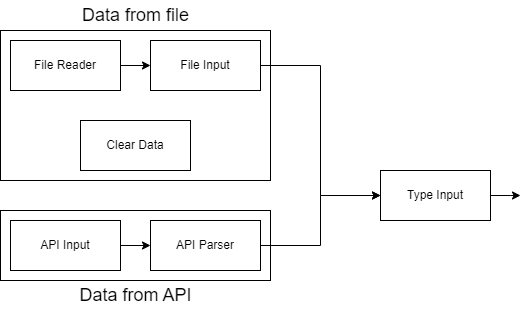

# Data module

  

The data module is the very beggining of this application's workflow, allowing the ingestion of data from multiple sources and formatting it such that the others modules can operate on it seamlessly. It operates on two fronts: raw data from _.csv_ or _JSON_ files, and _JSON_ results of API calls, both of which are formatted into a standardized format through a shared workflow. As such, this module sets the basis upon which all other modules can operate.

This is an explanation of the components contained in this module and their relationship to each other and other modules.

# Folder and Files Structure

Our project is divided into the following folders and files:

~~~
├── README.md <- module specification
│
├── availableNodes.json    <-  Specification of main components for workflow integration
│
├── src    <- developed components
│    ├── filereader-oid.js <- component for reading .json and .csv files and saving them in the database
│    ├── fileinput-oid.js <- component for reading and processing the database
│    ├── cleardata-oid.js <- component to clean up the database
│    ├── listtables-oid.js <- component to list tables in database
│    ├── typeinput-oid.js <- component for assigning types to the read data columns
│    ├── table-view-oid.js <- component for viewing data in tables
│    ├── apiinput-oid.js <- component to make requests to public and private APIs
│    ├── api-parser.js <- component for processing the results obtained by the API
│    └── value-to-raw-oid.js 
│
├── examples    <- examples of how components work in a unitary way
│
├── examples-itegration    <- examples of components developed interacting with components from other teams
│
└── images    <- images used in the module specification

~~~

# Team QR2.0
* Giovana Kerche Bonás
	* Responsible for architecture and development of the _File Input_, _File Reader_, _Clear Data_ and _List Tables_ components, part of the _data from file_ pipeline.
* Gustavo Araújo Morais
	* Responsible for architecture and development of the _API Input_ and _API parser_ components, part of the _data from API_ pipeline.
* João Guilherme Alves Santos
	* Responsible for architecture and development of the _File Input_, _File Reader_, _Clear Data_ and _List Tables_ components, part of the _data from file_ pipeline.
* Raniery Rodrigues da Silva
	* Responsible for architecture and development of the _Type Input_ component, which is part of the process of standardization of data ingested.
* Leonardo Livrare Martins
	* Responsible for architecture and development of the _API Input_ and _API parser_ components, part of the _data from API_ pipeline.

# Message Types
These are the message types exchanged between components of this module and from this module to others.

**_TreatedDataContent_**

Data collected. Still needs to be typed by the _Type Input_ component
~~~json
{
	"columns": [name, ...],
	"data": [
		[column0, column1, ...],
		... // Other rows
	]
}
~~~
**_TypedDataContent_**

The standard for data storage throghout the application. Contains the name and type for each column, as well as the data that's being stored.
~~~json
{
	{
		"columns": [{name: Column0, type: string}, ...],
		"data": [
			[element0, element1, ...],
			... // Other rows
		]
	}
}
~~~
**_TreatedReaderContent_**

Used to request a file stored in _IndexedDB_ to be read. Database is the fixed name that we chose to compose the IndexedDB (DatabaseMundorum) and table is the name of the file with the chosen standardization (name_of_file__MundorumDS). 
~~~json
{
	"database": string, 
	"table": string
}
~~~
**_RawAPIRequest_**

Holds the info to an API request.
~~~json
{
	"api_url": string,
	"method": string,
	"headers": string,
	"body": string
}
~~~
**_RawAPIContent_**

Holds the contents returned by an API.
~~~js
[{object}, ...]
~~~
**_TablesInDatabase_**

Returns the list of tables present in the database;
~~~js
[{"database": string,"table0": string},{"database": string,"table1": string},...]
~~~
**_ErrorDuringDataIngestion_**

Signifies an error that occurs during a process of data ingestion, such as reading from a file or API.
~~~json
{
	"error": string
}
~~~
**_ErrorDuringDataProcessing_**

Signifies an error that occurs during a process of data processing, such as in the _Input Type_ component.
~~~json
{
	"error": string,
	"line": number
}
~~~

# Components

  

---
## Component *file-reader*

The responsibility of this component is to read data from .csv and .json files and save it in a database. To accomplish this, a visual area has been developed that functions as a drag-and-drop feature, allowing users to drag their files onto it.
In addition, the component makes use of a well-known tool called IndexedDB, which is a low-level API for client-side storage of significant amounts of structured data. The component stores data in a fixed-named database within a collection that is named the same way as the inserted file (the name is processed to remove unsupported characters). Depending on the file extension, the data undergoes processing that handles both the collection keys and the content to store it in the appropriate manner.

### Properties

| property     | role     | receive by    
| ------------ | -------- | ------------- 
separator | character that makes the separation of csv files (by default chooses the comma) | HTML
file |   file is dragged into the area bounded by the component | HTML

### Input Notices

action | 
------ | 
drop file | 

### Output Notices

notice    | source | message type
----------| -------| ------------
loaded | As soon as the component finishes to store the content in Local Storage, it publishes the information about the database name and stored data name on the data bus. | TreatedReaderContent

---
## Component *file-input*

By using the database name and collection name provided, the component transforms raw data (which it retrieves from the Browser Local Storage) into a useful format for other components. If it fails to open the database or collection for processing, it emits an error message with a description of what occurred.

### Properties
| property     | role     | receive by    
| ------------ | -------- | ------------- 
TreatedReaderContent | The name of the database and table to read |  Bus

### Input Notices

notice | action | message type
-------| ------ | ------------
loaded | The component collects data from the received message with informations about the database and the table with data that needs to be get and initiates the process of catch data from the Local Storage into the JSON format. | TreatedReaderContent

### Successful Output Notices

notice    | source | message type
----------| -------| ------------
output_raw | As soon as the component finishes ingesting the JSON content, it publishes the result on the data bus. | TreatedDataContent

### Error Output Notices

notice    | source | message type
----------| -------| ------------
output_raw | Error during the reading of the database or collection | ErrorDuringDataIngestion

---
## Component *api-input*

This component is used to ingest from an API specified by the user. It receives an API request comprised of URL, method, headers and body, and executes it.

It is important to note that the data this component publishes on the bus is the raw data it receives from the API if the request was successful, or an error message otherwise. The standardization of this data is a responsibility of the *api-parser* component.

### Input Notices

notice | action | message type 
-------| ------ | ------------
load | The component collects the request and starts the process of ingesting the API. | RawAPIRequest

### Successful Output Notices

notice    | source | message type
----------| -------| ------------
output | When the request is finished, publishes the raw API content if the request was successful. | RawAPIContent 

### Error Output Notices

notice    | source | message type
----------| -------| ------------
output | Error during the reading of the API content | ErrorDuringDataIngestion

---
## Component *api-parser*

This component is responsible for standardizing the raw data obtained from APIs through the *api-input* component. It receives the raw data and transforms it into the untyped standard format. From here, it should be typed by a *type-input* component before it is used by other modules. 

### Input Notices

notice | action | message type
-------| ------ | ------------
input_raw | Collects the results of an API request and starts the process of transforming it into TreatedDataContent | RawAPIContent

### Output Notices

notice    | source | message type
----------| -------| ------------
output_processed | When the component finishes transforming the data received, publishes the treated data if the transformation was successful, or an error message otherwise. | TreatedDataContent or ErrorDuringDataIngestion

---
## Component *file-typing*

This component receives JSON data from the data bus and, through user input, attempts to correctly define the types of the data provided, defaulting to String if no input is given. It separates by 'sep' input the information column and data. After this process is finished, it inserts the typed data into the data bus.

### Properties
| property     | role     | receive by    
| ------------ | -------- | ------------- 
TreatedDataContent | Receives the raw file |  Bus

### Input Notices

notice | action | message type
-------| ------ | ------------
type-input | Receives a JSON file and asks the user for input on the types of the data provided | TreatedFileContent

### Output Notices

notice    | source | message type
----------| -------| ------------
output | As the component finishes transforming the data based on user input, publishes the result on the data bus | TypedDataContent or ErrorDuringDataProcessing

---
## Component *clear-data*

Component used to clean the bank. Bearing in mind that, mainly in the test phase, it is necessary to upload the same file several times.

### Properties

Don't have

### Input Notices

notice | action |
-------| ------ | 
click | Fires the event to do a complete cleaning of the database | 

### Output Notices
Don't have

---
## Component *list-tables*

This component lists all the tables that are saved in our database. Necessary for the help of other teams in the control of the read files.

### Properties

Don't have
### Input Notices

notice | action |
-------| ------ | 
click | Fires the event for checking the database| 

### Output Notices

notice    | source | message type
----------| -------| ------------
output_tables | Returns the list of tables present in the database | TablesInDatabase

# Components Narratives

## Setup
`file-reader` component
~~~html
<filereader-oid 
	sep="," 
	publish="loaded~file/loaded/[id]">
</filereader-oid>
~~~
`file-input` component
~~~html
<fileinput-oid
	subscribe="file/loaded/[id]~load_file"
	publish="output~show/message">
</fileinput-oid>
~~~
`api-input` component
~~~html
<api-input 
	subscribe="input_api/[id]~load"
    publish="output~receive_data/[id]">
</api-input>
~~~
`file-typing` component
~~~html
<file-typing
	subscribe="load_file/load/[id]~load_file"
	publish="output~[show/message]">
</file-typing>
~~~
`clear-data` component
~~~html
<cleardata-oid subscribe="data/clear~clear"><cleardata-oid>
~~~
`list-tables` component
~~~html
<listtables-oid subscribe="data/list~list" publish="output_tables~data/tables"></listtables-oid>
~~~

## Narrative
- The `file-reader` component recieves a file (csv or json), process the data and stores the data into the Browser Local Storage through a tool called IndexedDB. 
-  The `file-input` component recieves the information about the database and consults the Local Storage to give the data in a Json Format.
- The `listtables` component informs which tables are present in the database.
-  The `cleardata` component clean the database.
-   When workflow sends a new file message on the data bus being watched, the component starts the process.
-   It identifies the file format, which can be either CSV or JSON, and calls the appropriate JS function to transform the data.
-   It loops through all the rows of the file, transforming each one into a JSON format.
-   The component appends these JSON objects to the output message body.
-   If any error occurs during the process, the component stops execution and publishes an error message on the data bus, which can be displayed by front.
-   If all rows have been processed successfully with no errors, the transformed data in JSON format is published on the data bus.
---
-   The `api-input` component listens to the data bus to wait for the spreadsheet URL inside `inputAPI` attribute to be processed in string format.
-   When workflow sends a new url message on the data bus being watched, the component starts the process.
-   Calls the function in javascript that will make the connection with the api to obtain the data, transforming into a JSON format.
-   The component appends these JSON objects to the output message body.
-   If any error occurs during the process, the component stops execution and publishes an error message on the data bus.
-   If all rows have been processed successfully with no errors, the transformed data in JSON format is published on the data bus.
---
-	The `file-typing` component watches the data bus for incoming JSON files that must be typed.
-	It initiates the process on the result of the process of a `file-input` or `api-input` component.
-	It sends a message triggers the opening of an interface that asks the user to indicate the types of each column of the data in question.
-	Based on the user's response, it types the data received.
-   If any error occurs during the process, the component stops execution and publishes an error message on the data bus.
-   If all rows have been processed successfully with no errors, the typed data in JSON format is published on the data bus.

## Examples

### File Module Integration
Operating diagram:
[File Input](images/diagram_file_input.png)

Examples of use with integration between the data and transform groups:

*[Filter](examples-integration/file-transform/filter.html)

*[Mode](examples-integration/file-transform/mode.html)

*[File to test](examples-integration/file-transform/cursos.csv)

Examples of use with integration between the data and model groups:

*[Cluster](examples-integration/file-model/cluster.html)

*[PCA](examples-integration/file-model/pca.html)

*[Arquivo para teste](examples-integration/file-model/entrada.csv)

### File Module 
Examples of use components:

*[Integration between file reader, file input and file typing](examples/exampleTypeInputTemplate.html)

*[List Tables](examples/exampleListTables.html)

*[Clear Data](examples/exampleClearData.html)

*[File to test](examples/zombie-diet.csv)