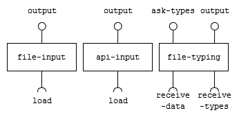
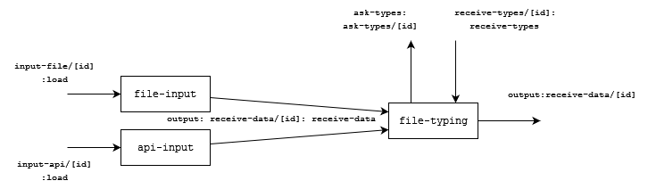

# Module `Data`

# Description
> Our module's responsibility is to gather raw data from files and APIs and transform it into useful data for the other components to use. Essentially, we take raw data and convert it into a JSON format, which is then inserted into the data bus.

# Team `QR2.0`
* `Giovana Kerche Bonás`
	* `Responsible for architecting and developing the api-input component to transform into JSON.`
* `Gustavo Araújo Morais`
	* `Responsible for architecting and developing the file-typing, this processes JSON data and send to data bus.`
* `João Guilherme Alves Santos`
	* `Responsible for architecting and developing the api-input component to transform into JSON.`
* `Raniery Rodrigues da SIlva`
	* `Responsible for architecting and developing the file input component to transform into JSON.`
* `Leonardo Livrare Martins`
	* `Responsible for architecting and developing the file input component to transform into JSON.`

# Message Types

**`RawFileContent`**
~~~json
{
  "file_id": string,
  "file_format": string,
  "file_content": string
}
~~~
**`TreatedDataContent`**
~~~json
{
	"file_id": string,
	"columns": [{name, type}, ...],
	"data": [
		[column0, column1, ...],
		... // Other rows
	]
}
~~~
**`FileTypeRequest`**
~~~json
{
	"data": TreatedDataContent,
	"return_notice": string
}
~~~
**`FileTypeInfo`**
~~~json
{
	"types": [type, ...]
}
~~~
**`ErrorDuringDataProcessing`**
~~~json
{
	"file_id": string,
	"error": string,
	"line": number
}
~~~
**`RawAPIContent`**
~~~json
{
	"file_id": string,
	"api_type": string,
	"url_content": string
}
~~~

# Components

## Component `file-input`

> The responsibility of this component is to collect raw data from csv and xlsx files and transform it into a useful format for other components. Specifically, we convert the raw data into a JSON format, which is then inserted into the data bus.

### Input Notices

notice | action | message type
-------| ------ | ------------
`load` | `The component collects data from the received message and initiates the process of transforming the raw data from the file into the JSON format.` | `RawFileContent`

### Output Notices

notice    | source | message type
----------| -------| ------------
`output` | `As soon as the component finishes transforming the raw data into JSON, it publishes the result on the data bus.` | `TreatedDataContent` or `ErrorDuringDataProcessing`

---
## Component `api-input`

>For this component, the responsibility is to collect raw data from an API specified by us. Initially we are thinking about the implementation for the google sheet API that will take data from online spreadsheets and transform it into a useful format for other components. Similar to file-input, we convert the raw data into a JSON format, which is then inserted into the data bus.

### Input Notices

notice | action | message type
-------| ------ | ------------
`load` | `The component collects the url received and starts the process of obtaining and transforming the raw data into JSON format.` | `RawAPIContent`

### Output Notices

notice    | source | message type
----------| -------| ------------
`output` | `As soon as the component finishes transforming the raw data into JSON, it publishes the result on the data bus.` | `TreatedDataContent` or `ErrorDuringDataProcessing`

---
## Component `file-typing`

> This component receives JSON data from the data bus and, through user input, attempts to correctly define the types of the data provided, defaulting to String if no input is given. After this process is finished, it inserts the typed data into the data bus.

### Input Notices

notice | action | message type
-------| ------ | ------------
`receive_data` | `Receives a JSON file and asks the user for input on the types of the data provided` | `TreatedFileContent`
`receive_types` | `Receives user input on data types and modifies the TreatedFileContent based on it` | `FileTypeInfo`

### Output Notices

notice    | source | message type
----------| -------| ------------
`ask_types` | `Once the component receives a JSON file, it publishes a request for a user interface to ask for typing info` | `FileTypeRequest`
`output` | `As the component finishes transforming the data based on user input, publishes the result on the data bus` | `TreatedFileContent` or `ErrorDuringDataProcessing`

# Components Narratives

## Setup
> `file-input` component
~~~html
<file-input
	subscribe="input_file/[id]:load"
	publish="output:receive_data/[id]">
</file-input>
~~~
> `api-input` component
~~~html
<api-input 
	subscribe="input_api/[id]:load"
    publish="output:receive_data/[id]">
</api-input>
~~~
> `file-typing` component
~~~html
<file-typing
	subscribe="receive_types/[id]:receive_types;receive_data/[id]:receive_data"
	publish="output:receive_data/[id];ask_types:ask_types/[id]">
</file-typing>
~~~

## Narrative
-   The `file-input` component watches the data bus for incoming file input that needs to be processed and transformed into JSON format.
-   When workflow sends a new file message on the data bus being watched, the component starts the process.
-   It identifies the file format, which can be either CSV or XLSX, and calls the appropriate JS function to transform the data.
-   It loops through all the rows of the file, transforming each one into a JSON format.
-   The component appends these JSON objects to the output message body.
-   If any error occurs during the process, the component stops execution and publishes an error message on the data bus, which can be displayed by front.
-   If all rows have been processed successfully with no errors, the transformed data in JSON format is published on the data bus.
---
-   The `api-input` component listens to the data bus to wait for the spreadsheet URL inside `inputAPI` attribute to be processed in string format.
-   When workflow sends a new url message on the data bus being watched, the component starts the process.
-   Calls the function in javascript that will make the connection with the api to obtain the data, transforming into a JSON format.
-   The component appends these JSON objects to the output message body.
-   If any error occurs during the process, the component stops execution and publishes an error message on the data bus.
-   If all rows have been processed successfully with no errors, the transformed data in JSON format is published on the data bus.
---
-	The `file-typing` component watches the data bus for incoming JSON files that must be typed.
-	It initiates the process on the result of the process of a `file-input` or `api-input` component.
-	It sends a message triggers the opening of an interface that asks the user to indicate the types of each column of the data in question.
-	Based on the user's response, it types the data received.
-   If any error occurs during the process, the component stops execution and publishes an error message on the data bus.
-   If all rows have been processed successfully with no errors, the typed data in JSON format is published on the data bus.