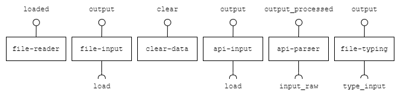
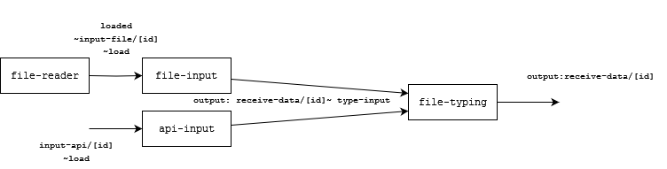

# Module `Data`

# Description
Our module is responsible for reading files (.json and .csv) and collecting raw data from APIs to transform them into a predefined format that is useful for other components to use. Essentially, we take the raw data and convert it into a JSON format, which is then inserted into the data bus.

# Team `QR2.0`
* `Giovana Kerche Bonás`
	* `Responsible for architecting and developing the file-input and file-reader components to transform into JSON.`
* `Gustavo Araújo Morais`
	* `Responsible for architecting and developing the api-input, this processes JSON data and send to data bus.`
* `João Guilherme Alves Santos`
	* `Responsible for architecting and developing the clear-data, file-input and file-reader components to transform into JSON.`
* `Raniery Rodrigues da Silva`
	* `Responsible for architecting and developing the file typing component to transform into JSON.`
* `Leonardo Livrare Martins`
	* `Responsible for architecting and developing the api-input component to transform into JSON.`

# Message Types

**`RawFileContent`**
~~~json
{
	"database": string, 
	"table": string, 
	"file_name": string, 
	"file_extension": string
}
~~~
**`TreatedDataContent`**
~~~json
{
	"columns": [name, ...],
	"data": [
		[column0, column1, ...],
		... // Other rows
	]
}
~~~
**`TypedDataContent`**
~~~json
{
	{
		"columns": [{name: string, type: string}, ...],
		"data": [
			[column0, column1, ...],
			... // Other rows
		]
	}
}
~~~
**`TreatedReaderContent`**
~~~json
{
	"database": string, 
	"table": string, 
	"file_name": string, 
	"file_extension": string
}
~~~
**`ErrorDuringDataIngestion`**
~~~json
{
	"error": string
}
~~~
**`ErrorDuringDataProcessing`**
~~~json
{
	"error": string,
	"line": number
}
~~~
**`RawAPIRequest`**
~~~json
{
	"api_url": string,
	"method": string,
	"headers": string,
	"body": string
}
~~~
**`RawAPIContent`**
~~~js
[{object}, ...]
~~~

# Components

## Component `file-reader`

The responsibility of this component is to collect a file (CSV or JSON) from the user, process it doing some fell steps of pre-processing data steps and stores it in the browser's Local Storage.

### Output Notices

notice    | source | message type
----------| -------| ------------
`loaded` | `As soon as the component finishes to store the content in Local Storage, it publishes the information about the database and stored data on the data bus.` | `TreatedReaderContent`
## Component `file-input`

The responsibility of this component is to collect data from Local Storage and transform it into a useful format for other components. Specifically, this component catch data from the Browser Local Storage, which is then inserted into the data bus.

### Input Notices

notice | action | message type
-------| ------ | ------------
`load` | `The component collects data from the received message with informations about the database and the table with data that needs to be get and initiates the process of catch data from the Local Storage into the JSON format.` | `RawFileContent` or `TreatedReaderContent` 

### Output Notices

notice    | source | message type
----------| -------| ------------
`output` | `As soon as the component finishes ingesting the JSON content, it publishes the result on the data bus.` | `TreatedDataContent` or `ErrorDuringDataIngestion`

---
## Component `api-input`

For this component, the responsibility is to collect raw data from an API specified by us. Initially we are thinking about the implementation for the google sheet API that will take data from online spreadsheets and transform it into a useful format for other components. Similar to file-input, we convert the raw data into a JSON format, which is then inserted into the data bus.

### Input Notices

notice | action | message type
-------| ------ | ------------
`load` | `The component collects the url received and starts the process of obtaining and transforming the raw data into JSON format.` | `RawAPIRequest`

### Output Notices

notice    | source | message type
----------| -------| ------------
`output` | `As soon as the component finishes transforming the raw data into JSON, it publishes the result on the data bus.` | `RawAPIContent` or `ErrorDuringDataIngestion`

---
## Component `api-parser`

This component receives raw api content as a list of objects and transforms it into TreatedDataContent

### Input Notices

notice | action | message type
-------| ------ | ------------
`input_raw` | `Collects the results of an API request and starts the process of transforming it into TreatedDataContent` | `RawAPIContent`

### Output Notices

notice    | source | message type
----------| -------| ------------
`output_processed` | `As the component finishes transforming the data received, publishes it as TreatedDataContent` | `TreatedDataContent` or `ErrorDuringDataIngestion`

---
## Component `file-typing`

This component receives JSON data from the data bus and, through user input, attempts to correctly define the types of the data provided, defaulting to String if no input is given. It separates by 'sep' input the information column and data. After this process is finished, it inserts the typed data into the data bus.

### Input Notices

notice | action | message type
-------| ------ | ------------
`type-input` | `Receives a JSON file and asks the user for input on the types of the data provided` | `TreatedFileContent`

### Output Notices

notice    | source | message type
----------| -------| ------------
`output` | `As the component finishes transforming the data based on user input, publishes the result on the data bus` | `TypedDataContent` or `ErrorDuringDataProcessing`

# Components Narratives

## Setup
`file-reader` component
~~~html
<filereader-oid 
	sep="," 
	publish="loaded~file/loaded/[id]">
</filereader-oid>
~~~
`file-input` component
~~~html
<fileinput-oid
	subscribe="file/loaded/[id]~load_file"
	publish="output~show/message">
</fileinput-oid>
~~~
`api-input` component
~~~html
<api-input 
	subscribe="input_api/[id]~load"
    publish="output~receive_data/[id]">
</api-input>
~~~
`file-typing` component
~~~html
<file-typing
	subscribe="load_file/load/[id]~load_file"
	publish="output~[show/message]">
</file-typing>
~~~

## Narrative
- The `file-component` component recieves a file (csv or json), process the data and stores the data into the Browser Local Storage. 
-   The `file-input` component recieves the information about the database and consults the Local Storage to give the data in a Json Format.
-   When workflow sends a new file message on the data bus being watched, the component starts the process.
-   It identifies the file format, which can be either CSV or JSON, and calls the appropriate JS function to transform the data.
-   It loops through all the rows of the file, transforming each one into a JSON format.
-   The component appends these JSON objects to the output message body.
-   If any error occurs during the process, the component stops execution and publishes an error message on the data bus, which can be displayed by front.
-   If all rows have been processed successfully with no errors, the transformed data in JSON format is published on the data bus.
---
-   The `api-input` component listens to the data bus to wait for the spreadsheet URL inside `inputAPI` attribute to be processed in string format.
-   When workflow sends a new url message on the data bus being watched, the component starts the process.
-   Calls the function in javascript that will make the connection with the api to obtain the data, transforming into a JSON format.
-   The component appends these JSON objects to the output message body.
-   If any error occurs during the process, the component stops execution and publishes an error message on the data bus.
-   If all rows have been processed successfully with no errors, the transformed data in JSON format is published on the data bus.
---
-	The `file-typing` component watches the data bus for incoming JSON files that must be typed.
-	It initiates the process on the result of the process of a `file-input` or `api-input` component.
-	It sends a message triggers the opening of an interface that asks the user to indicate the types of each column of the data in question.
-	Based on the user's response, it types the data received.
-   If any error occurs during the process, the component stops execution and publishes an error message on the data bus.
-   If all rows have been processed successfully with no errors, the typed data in JSON format is published on the data bus.

## Examples

### File Input and File Reader

An example usage of file-input and file-reader with a component of group model can be found in the folder `data/examples-integration/data-model`.

An example usage of file-input and file-reader can be found in the folder `data/examples/exampleGetDBTable.html`.
