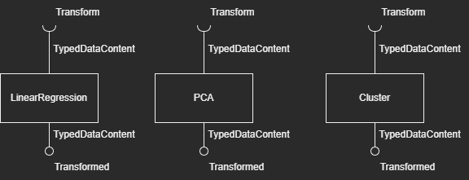

# Module Model

# Description
Realiza transformações estatísticas em conjuntos de dados usando técnicas de aprendizado de máquina.

# Team - Time Extra
* Otávio Silveira Munhoz - 204280
* Régis Gabetta De Souza - 223965
* Felipe Hideki Matoba - 196767
* Fernando de Sáes Madeira Vallar - 171509
* João Pedro Vianini de Paula - 176241

# Message Types

**TypedDataContent**
~~~json
{
  "columns": [{"name":"name", "type":"type"}],
  "data": [
    ["coluna0", "coluna1", "..."],
    ["coluna0", "coluna1", "..."],
    "..." 
  ]
}
~~~

O objeto contém o array de objetos _columns_, que representa o nome e o tipo de cada coluna da tabela e o array de arrays data, contendo os dados da tabela, cujo tipo depende dos dados inseridos.

# Components

## Component Cluster

Recebe o _TypedDataContent_, aplica o modelo de clusterização e devolve os dados transformados para o barramento. Pode ser passado o parâmetro _num_cluster_, que indica a quantidade de clusters que o modelo deverá gerar e o _max_iterations_, que é o número máximos de iterações que o algoritmo irá executar.

A saída desse componente será igual à tabela recebida na entrada, mas terá duas novas colunas, _category_ e _is_centroid_ acrescentadas à sua estrutura;    
A coluna _category_ será um inteiro, que representará a qual cluster cada ponto pertence, enquanto a _is_centroid_ indica se o ponto é um centroide ou não; 
Se houverem _n_ clusters, o _i_-ésimo cluster terá a categoria _i_, para 1 ≤ _i_ ≤ _n_.

### Properties
property | role
-------| ------
num_clusters | Definir o número de clusters que deverão ser gerados 
max_iterations | Definir o número máximo de iterações do algoritmo 

### Input Notices

notice | action | message type
-------| ------ | ------------
transform | O usuário envia um pedido de transformação dos dados por clusterização | TypedDataContent

### Output Notices

notice    | source | message type
----------| -------| ------------
transformed | O componente envia os dados transformados para o barramento | TypedDataContent

## Component PCA

Recebe o _TypedDataContent_, reduz a dimensionalidade para uma ou duas dimensões através da aplicação do modelo de PCA e devolve os dados transformados para o barramento.

### Properties
property | role
-------| ------
target_dimension | Define se a tabela retornada terá uma ou duas dimensões 

### Input Notices

notice | action | message type
-------| ------ | ------------
transform | O usuário envia um pedido de redução de dimensionalidade de uma tabela através da aplicação do modelo PCA | TypedDataContent

### Output Notices

notice    | source | message type
----------| -------| ------------
transformed | O componente envia os dados transformados para o barramento | TypedDataContent

## Component LinearRegression

Recebe o _TypedDataContent_, aplica o modelo de Regressão Linear gerando os pontos da linha que melhor representa o modelo e devolve os dados transformados para o barramento. Para esse componente funcionar, será necessário o parâmetro target_index que indica em qual coluna deve ser feita a regressão linear. 
>
A saída desse componente será igual à tabela recebida na entrada, mas terá uma nova coluna, _y\__ acrescentada à sua estrutura;    
A coluna _y\__ será um número (float), que representará o valor da coluna target_index linearizada. Então, em um exemplo de 2 colunas (x e y), com target_index = 1, caso o usuário plote um gráfico com as colunas 0 e 1 ele terá os pontos originais, caso ele plote as colunas 0 e 2 ele terá os pontos linearizados; 

### Properties
property | role
-------| ------
target_index | Define qual coluna da tabela é a coluna "resultado". O valor dessa coluna deve ser entre 0 até a quantidade de colunas - 1.

### Input Notices

notice | action | message type
-------| ------ | ------------
transform | O usuário envia um pedido para gerar a linha que melhor representa os dados | TypedDataContent

### Output Notices

notice    | source | message type
----------| -------| ------------
transformed | O componente envia os dados transformados para o barramento. | TypedDataContent
error | Aconteceu algum tipo de erro durante a transformação. Coloca no barramento a mensagem do erro. |  String

# Components Narratives

## Setup

~~~html

<ml-cluster-oid 
  subscribe="model/cluster/transform~transform" 
  publish="transformed~data/transformed">
</ml-cluster-oid>

<ml-apply-pca
  target_dimension=2 
  subscribe="model/pca/transform~transform" 
  publish="transformed~data/transformed">
</ml-apply-pca>

<ml-lr-oid 
  target_index="1" 
  subscribe="data/processed~transform" 
  publish="transformed~data/transformed">
</ml-lr-oid>

~~~

## Narrative
A narrativa a seguir funciona para todos os componentes citados no setup acima

* O componente irá subscrever no barramento assinando o tópico model/\<component>/transform
* O componente realizará a leitura dos dados de input, que chegam no formato _TypedDataContent_
* O componente realizará uma filtragem dos dados (ou lançar um erro) caso tenha colunas que não são do tipo number
* O componente realizará a transformação nos dados 
* O componente publica no barramento pelo tópico transformed o resultado, que também está no formato _TypedDataContent_

### Examples
Você pode encontrar exemplos dos componentes funcionando integrados na pasta ./examples/, ou através das urls: (precisa estar com o sistema rodando localmente)
* http://localhost:5173/modules/model/examples/dataLinearRegressionIntegration.html
* http://localhost:5173/modules/model/examples/dataPCAIntegration.html
* http://localhost:5173/modules/model/examples/dataClusterIntegration.html
* http://localhost:5173/modules/model/examples/visualizeClusterIntegration.html
* http://localhost:5173/modules/model/examples/visualizePCAClusterIntegration.html
* http://localhost:5173/modules/model/examples/visualizeLinearRegressionIntegration.html

Para rodar os exemplos que começam com "data", basta arrastar um dos arquivos csv da pasta support na região indicada. Nos exemplos de "visualize", primeiro é preciso selecionar o tipo de gráfico adequado no menu "type", podendo ser Cluster ou Linear Regression, pressionar o "Send Options" e em seguida arrastar o arquivo csv.

Caso deseje rodar o exemplo novamente, primeiro apertar o botão "Clear DB" para que a execução anterior não atrapalhe o resultado.

