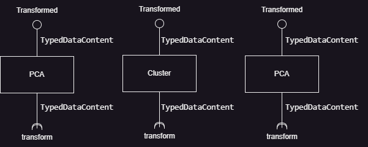

# Module Model

# Description
> Realiza transformações estatísticas em conjuntos de dados usando técnicas de aprendizado de máquina.

# Team - `Time Extra`
* `Otávio Silveira Munhoz - 204280`
* `Régis Gabetta De Souza - 223965`
* `Felipe Hideki Matoba - 196767`
* `Fernando de Sáes Madeira Vallar - 171509`
* `João Pedro Vianini de Paula - 176241`

# Message Types

**`ClusterOutput`**
~~~json
{
  "columns": [{"name":"x", "type":"num"}, {"name":"y", "type":"num"}, {"name":"category", "type":"num"}],
  "data": [
    ["xLinha0", "yLinha0", "categorylinha0"],
    ["xLinha1", "yLinha1", "categorylinha1"],
    "...",
    ["xLinhaN", "yLinhaN", "categorylinhaN"],
  ]
}
~~~
A saída ClusterOutput será igual a tabela recebida na entrada, mas terá a nova coluna "category" acrescentada à usa estrutura;  
A coluna category será um inteiro, que representará a qual cluster cada ponto pertence;  
O primeiro cluster terá a categoria 1, o segundo cluster terá a categoria 2, ..., e o cluster n terá a categoria n;  
Para efeito de visualização ao plottar o gráfico resultante, os centróides de cada cluster sempre terão a categoria settada como "0"  

**`TypedDataContent`**
~~~json
{
  "columns": [{"name":"name", "type":"type"}],
  "data": [
    ["coluna0", "coluna1", "..."],
    ["coluna0", "coluna1", "..."],
    "..."
  ]
}
~~~

O objeto contém o array de objetos columns, que representa o nome e o tipo de cada coluna da tabela, o data, com um o array que contém os dados da tabela, cujo tipo depende dos dados inseridos.

# Components

## Component `Cluster`

Recebe o TypedDataContent, aplica o modelo de clusterização. Por fim, devolve os dados transformados para o barramento. Para esse componente funcionar, será necessário o parâmetro `num_cluster`, que indica a quantidade de cluster que o modelo deverá gerar

### Properties
property | role
-------| ------
`num_clusters` | `Definir o número de clusters que deverão ser gerados` 
`max_iterations` | `Definir o número máximo de iterações do algoritmo` 

### Input Notices

notice | action | message type
-------| ------ | ------------
`transform` | `O usuário envia um pedido de transformação dos dados por clusterização` | `ClusterOutput`

### Output Notices

notice    | source | message type
----------| -------| ------------
`transformed` | `O componente envia os dados transformados para o barramento` | `ClusterOutput`

## Component `PCA`

Recebe o TypedDataContent, reduz a dimensionalidade para uma ou duas dimensões através da aplicação do modelo de PCA. Por fim, devolve os dados transformados para o barramento.

### Properties
property | role
-------| ------
`target_dimension` | `Define se a tabela retornada terá uma ou duas dimensões` 

### Input Notices

notice | action | message type
-------| ------ | ------------
`transform` | `O usuário envia um pedido de redução de dimensionalidade de uma tabela através da aplicação do modelo PCA` | `TypedDataContent`

### Output Notices

notice    | source | message type
----------| -------| ------------
`transformed` | `O componente envia os dados transformados para o barramento` | `TypedDataContent`

## Component `LinearRegression`

Recebe o TypedDataContent, aplica o modelo de Regressão Linear gerando os pontos da linha que melhor representa o modelo. Por fim, devolve os dados transformados para o barramento. Para esse componente funcionar, será necessário o parâmetro `target_index`, que indica em qual coluna deve ser feita a regressão linear.

### Properties
property | role
-------| ------
`target_index` | `Define qual coluna da tabela é a coluna "resultado". O valor dessa coluna deve ser entre 0 até a quantidade de colunas - 1.`

### Input Notices

notice | action | message type
-------| ------ | ------------
`transform` | `O usuário envia um pedido para gerar a linha que melhor representa os dados` | `TypedDataContent`

### Output Notices

notice    | source | message type
----------| -------| ------------
`transformed` | `O componente envia os dados transformados para o barramento.` | `TypedDataContent`
`error` | `Aconteceu algum tipo de erro durante a transformação. Coloca no barramento a mensagem do erro.` |  `String`

# Components Narratives

## Setup

~~~html
<data-component attribute="value"
                publish="notice:statistics/pca">
</data-component>

<pca
                subscribe="statistics/pca:transformation"
                publish="transformation:statistics/output">
</pca>

<exibe-grafico
                subscribe="statistics/output:display">
</exibe-grafico>
~~~

## Narrative

* O componente PCA irá subscrever no barramento assinando o tópico statistics/pca
* O componente do grupo de dados ou de tranformação (chamado ficticilmente de data-component) publica um pedido de transformação nesse tópico
* O componente PCA recebe o pedido e:
  * Desserializa os dados;
  * Realiza a transformação;
  * Serializa a resposta;
  * Publica no barramento em statistics/output.
* O componente fictício exibe-grafico, subscrito no statistics/output, recebe os dados transformados e exibe o gráfico correspondente.
* No exemplo, utilizamos apenas o componente PCA, mas o setup e a narrativa são as mesmas para o componente `cluster` e `linear-regression`

### Examples
* Você pode encontrar exemplos dos componentes funcionando integrados na pasta ./examples/, ou através das urls: (precisa estar com o sistema rodando localmente)
* `http://localhost:5173/modules/model/examples/dataLinearRegressionIntegration.html`
* `http://localhost:5173/modules/model/examples/dataPCAIntegration.html`
* `http://localhost:5173/modules/model/examples/dataClusterItegration.html`
