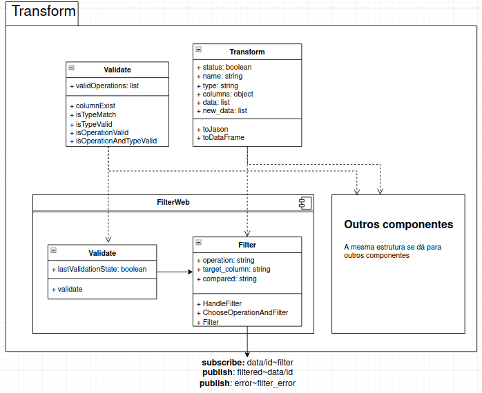
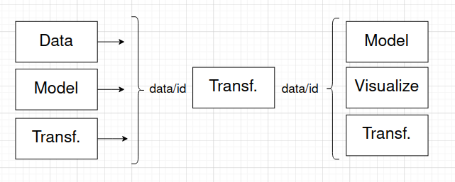

# Module Transform

# Description
Esse módulo pretende receber pedidos de transformações relacionais para determinados dados, e retornar os dados já processados como foi desejado pela entrada, como por exemplo: filtrar dados, join de colunas, drop de colunas, etc.

# Team
Cícero Pizzol Libardi - RA 168810  
Fábio de Andrade Barboza - RA 168817  
Isabella Garcia Fagioli - RA 173174  
Jéssica da Silva Oliveira - RA 173931  

# Message Types

**`table`**
~~~json
{
  "file_id": "<string>",
  "columns": [
    {
      "name": "<string>",
      "type": "<string>"
    },
    {
      "name": "<string>",
      "type": "<string>"
    }
  ],
  "data": [
    ["column1","column2","column_n"],
    ["column1","column2","column_n"],
  ]
}

~~~

**`singleValue`**

~~~json
{
  "value": "<any>"
}
~~~

> Esse foi o formato da tabela acordado entre os grupos. Cada componente de `transform` estará apto a receber essa tabela como entrada para suas transformações e a devolver no mesmo formato como saída. As saídas de alguns componentes podem ser valores inteiros simples (como média, mínimo, etc). Por isso, temos também um tipo para uma variável simples. 

**`transformationError`**
~~~json
{
  "transformationType": "<string>",
  "errorType": "<string>",
  "message": "<string>"
}
~~~

> Caso haja erro durante as transformações, cada componente terá seus tipos de erro, com as respectivas mensagens. 

# Components

> Há dois componentes: um componente web voltado para as transformações e um componente para apresentar os resultados da transformação.

## Component `PresentTransformation`

> Componente oid responsável por receber as saídas das transformações, sejam tabelas ou números, e criar um html para mostrar ao usuário o resultado. Mostra o resultado na área dedicada a apresentação, esse resultado é o valor de saída do cmponente ao qual esse é conectado

### Properties

property | role
---------| --------
`title` | `título da região dedicada a mostrar a saída desejada`
`position` | `é a posição, entre as disponíveis, que a apresentação terá na tela`

### Input Notices

notice | action | message type
-------| ------ | ------------
`filter` | `valida os arguntos de uma filtragem que é requisitada por algum outro componente` | `filterInput`

## Component `Transform`

property | role
---------| --------
`table` | `tabela resultante da transformação em formato json`
`status` | `estado da operação relacional (se foi bem sucedida ou não)`
`df` | `tabela em formato de DataFrame`
`file_id` | `arquivo do qual a tabela foi proveniente inicialmente`
`columns` | `objeto com o nome das coluna como chave e o seu tipo como valor`
`dfd` | `objeto da biblioteca Danfo a partir do qual obtmos as funcionaidades`

> Esse componente apresenta funcionalidades e propriedades comuns a todos os componentes de transformação, por isso cada componente de transformação específico o herdará. 

### Class `Validate`

> Antes que as transformações ocorram, é necessário verificar a validade dos parâmetros passados para o componente que realizará a transformação. Sendo assim, cada componente de transformação é composto por uma classe que de validação, cujas funções o componente usa antes de realizar as operaões.

> Como cada classe dessa tem métodos e atributos comuns, uma super classe foi construída. Todas as classes de validação são herdeiras dela.

> A imagem abaixo mostra a arquitetura geral integrando esse componente essas classes para o exemplo do componente de transformação `filter`.

## Component `filter`

> Filtra as linhas de uma tabela com base na coluna, operação e valor de comparação passados por mensagem.

### Properties

property | role
---------| --------
`target_column` | `coluna com base na qual as linhas serão filtradas`
`operation` | `operação de comparação que será usada na coluna alvo`
`compared_value` | `valor que será comparado na operação com cada valor da coluna alvo`

### Input Notices

notice | action | message type
-------| ------ | ------------
`filterOperation` | `filtra uma tabela de dados, gerando outra` | `filterInput`

### Output Notices

notice    | source | message type
----------| -------| ------------
`filterError` | `é ativado quando a operação de filtrar termina e há erros` | `transformationError`
`filterResult` | `é ativado quando a operação de filtrar termina` | `table`

## Component `groupBy`

> Agrupa as linhas cuja coluna especificada apresenta elementos em comum. Realiza operações sobre as linhas agrupadas em uma coluna específica, passada pelo usuário. Salva o resultado dessa operação em uma nova coluna, com o nome especificado pelo usuário. Retorna a nova coluna e a coluna que foi agrupada. 

### Properties

property | role
---------| --------
`group_by_target_column` | `coluna com base na qual os valores serão agrupados`
`operation_target_column` | `coluna na qual será realizada uma operação a lista de dados agrupadas resultante`
`operation` | `operação realizada na coluna de operação`
`result_column` | `nome da coluna resultante após a operação`

### Input Notices

notice | action | message type
-------| ------ | ------------
`groupby` | `agrupa as linhas da tabela fornecida` | `table`

### Output Notices

notice    | source | message type
----------| -------| ------------
`groupbyError` | `é ativado quando a operação de agrupar termina e há erros` | `transformationError`
`groupByResult` | `é ativado quando a operação de agrupar termina` | `table`

## Component `columnOperation`

> Cria uma nova coluna a partir de dados de, no máximo duas colunas, e retorna o valor dessa coluna em uma nova coluna, com nome especificado.

### Properties

property | role
---------| --------
`fisrt` | `coluna 1 da operação` 
`second` | `coluna 2 da operação`
`op` | `operação realizada entre as colunas`
`result` | `coluna resultante`

### Input Notices

notice | action | message type
-------| ------ | ------------
`columnOp` | `faz uma operação entre colunas e gera uma tabela com a atabela anterior mais a coluna resultante` | `table`

### Output Notices

notice    | source | message type
----------| -------| ------------
`transformationError` | `é ativado quando a operação termina e há um erro` | `transformationError`
`columnOpResult` | `é ativado quando a operação termina bem sucedida` | `table`

## Component `deleteColumn`

> Exclui uma coluna.

### Properties

property | role
---------| --------
`column` | `string com nome da coluna que será deletada`

### Input Notices

notice | action | message type
-------| ------ | ------------
`columnDel` | `apaga uma coluna` | `table`

### Output Notices

notice    | source | message type
----------| -------| ------------
`transformationError` | `é ativado quando a operação termina e há um erro` | `transformationError`
`columnDeleteResult` | `é ativado quando a operação termina bem sucedida` | `table`

## Component `minimum`

> Encontra e retorna o valor mínimo da coluna.

### Properties

property | role
---------| --------
`column` | `nome da coluna sobre a qual será buscado o valor mínimo`

### Input Notices

notice | action | message type
-------| ------ | ------------
`minimum` | `percorre a coluna indicada e encontra o valor mínimo` | `table`

### Output Notices

notice    | source | message type
----------| -------| ------------
`transformationError` | `é ativado quando a operação termina e há um erro` | `transformationError`
`minimumResult` | `é ativado quando a operação de encontrar o mínimo termina` | `singleValue`

## Component `maximum`

> Encontra e retorna o valor máximo da coluna.

### Properties

property | role
---------| --------
`column` | `nome da coluna sobre a qual será buscado o valor máximo`

### Input Notices

notice | action | message type
-------| ------ | ------------
`maximum` | `percorre a coluna indicada e encontra o valor máximo` | `table`

### Output Notices

notice    | source | message type
----------| -------| ------------
`transformationError` | `é ativado quando a operação termina e há um erro` | `transformationError`
`maximumResult` | `é ativado quando a operação de encontrar o máximo termina` | `singleValue`

## Component `count`

> Conta quantas vezes o elemento aparece na coluna.

### Properties

property | role
---------| --------
`column` | `nome da coluna sobre a qual os valores iguais serão contados`
`count_value` | `valor que se deseja contar na coluna`

### Input Notices

notice | action | message type
-------| ------ | ------------
`count` | `percorre a coluna indicada e conta quantas vezes o elemento aparece na mesma` | `table`

### Output Notices

notice    | source | message type
----------| -------| ------------
`transformationError` | `é ativado quando a operação termina e há um erro` | `transformationError`
`countResult` | `é ativado quando a operação de contar as aparições do elemento termina` | `singleValue`

## Component `unique`

> Conta quantos valores únicos estão presentes na coluna.

### Properties

property | role
---------| --------
`column` | `nome da coluna em que se deseja contar valores`

### Input Notices

notice | action | message type
-------| ------ | ------------
`unique` | `percorre a coluna indicada e conta quantos valores únicos estão presentes na mesma` | `table`

### Output Notices

notice    | source | message type
----------| -------| ------------
`transformationError` | `é ativado quando a operação termina e há um erro` | `transformationError`
`uniqueResult` | `é ativado quando a operação de contar os valores  termina` | `singleValue`

## Component `orderBy`

> Ordena as linhas com base no valor de uma coluna de forma crescente ou decrescente.

### Properties

property | role
---------| --------
`column` | `nome da coluna com base na qual se deseja ordenar`
`ascending` | `valor booleano que indica ordenação crescente ou decrescente`

### Input Notices

notice | action | message type
-------| ------ | ------------
`orderBy` | `ordena a coluna` | `table`

### Output Notices

notice    | source | message type
----------| -------| ------------
`transformationError` | `é ativado quando a operação termina e há um erro` | `transformationError`
`orderByResult` | `é ativado quando a operação de contar as aparições do elemento termina` | `table`

## Component `mean`

> Encontra e retorna o valor médio da coluna.

### Properties

property | role
---------| --------
`column` | `nome da coluna cujos valores serão usados para calcular a média`

### Input Notices

notice | action | message type
-------| ------ | ------------
`mean` | `percorre a coluna indicada e encontra o valor médio dessa coluna` | `table`

### Output Notices

notice    | source | message type
----------| -------| ------------
`transformationError` | `é ativado quando a operação termina e há um erro` | `transformationError`
`meanResult` | `é ativado quando a operação de encontrar o valor médio da coluna termina` | `singleValue`

## Component `median`

> Encontra e retorna o valor correspondente a mediana da coluna.

### Properties

property | role
---------| --------
`column` | `nome da coluna cujos valores serão usados para calcular mediana`

### Input Notices

notice | action | message type
-------| ------ | ------------
`median` | `percorre a coluna indicada e encontra o valor correspondente a mediana dessa coluna` | `table`

### Output Notices

notice    | source | message type
----------| -------| ------------
`transformationError` | `é ativado quando a operação termina e há um erro` | `transformationError`
`medianResult` | `é ativado quando a operação de encontrar o valor correspondente a mediana da coluna termina` | `singleValue`

## Component `mode`

> Encontra e retorna o valor correspondente a moda da coluna.

### Properties

property | role
---------| --------
`column` | `nome da coluna cujos valores serão usados para calcular a moda`

### Input Notices

notice | action | message type
-------| ------ | ------------
`mode` | `percorre a coluna indicada e encontra o valor correspondente a moda dessa coluna` | `table`

### Output Notices

notice    | source | message type
----------| -------| ------------
`transformationError` | `é ativado quando a operação termina e há um erro` | `transformationError`
`modeResult` | `é ativado quando a operação de encontrar o valor correspodente a moda da coluna termina` | `table`

## Component `standarddeviation`

> Encontra e retorna o valor correspondente ao desvio padrão populacional da coluna.

### Properties

property | role
---------| --------
`column` | `nome da coluna cujos valores serão usados para calcular o desvio padrão`

### Input Notices

notice | action | message type
-------| ------ | ------------
`stddev` | `percorre a coluna indicada e encontra o valor correspondente ao desvio padrão populacional dessa coluna` | `table`

### Output Notices

notice    | source | message type
----------| -------| ------------
`transformationError` | `é ativado quando a operação termina e há um erro` | `transformationError`
`stddevResult` | `é ativado quando a operação de encontrar o valor correspondente ao desvio padrão populacional da coluna termina` | `singleValue`

# Components Narratives

## Setup

~~~html
<validateFilter 
        status=false
        table = {}
        subscribe="filter/filterInput:validate"
        publish="validationSucceed:filterOperation/filterInput"
        publish="validationFailed:filterResult/operationResult"
        >
</validateFilter>

<filter
        status=false
        subscribe="filterOperation/filterInput:filter"
        publish="filtered:filterResult/operationResult">
</filter>
~~~

## Narrative

* A instanciação acima simula o estado do workflow no qual há nós (que podem ser de outro grupo ou outro componente de Transformação) antes depois do filtro, assim o filtro recebe uma entrada da saída do nó anterior e gera uma saída que é entrada para o próximo.
* Toda entrada e saída do formato `table` chega no barramento por meio do notice `data/id`, em que `data` indica que há uma tabela e `id` indica que o id do nó instanciado (valor criado pelo grupo de workflow para organizar os "vértices").

* Todos os componentes de transformação recebem dados em forma de tabela. Ja a saída, pode ser tabela ou valor único.
* O nó que faz o publish de uma tabela usa o notice `data/seu_id`, indicando que a mensagem é uma tabela e que a fonte dela é o nó cujo id foi especificado. O nó conectado a esse e que deseja receber mensagens dele, faz o subscribe com o notice `data/id_no_anterior`. Assim a tabela é passada pelos nós.
* Os valores digitados pelo usuário para fazer a operação são passados por parâmetro ao componente de Transformação.
* O componente `filter` é instanciado com o tópico `data/id` e com os devidos parâmetros. Internamente, irá usar um componente de validação para verificar a entrada e possíveis erros. Os tópicos publicados são dois possíveis:
  * `error`: caso ocorra algum erro na validação ou na própria execução da operação. O notice depende do componente e foi especificado por cada um na documentação. A mensagem publicada são infrmações do erro.
  * `filterResult`: caso a operação seja bem sucedida. A mensagem publicada é a tabela e o tópico segue o formato `data/id`